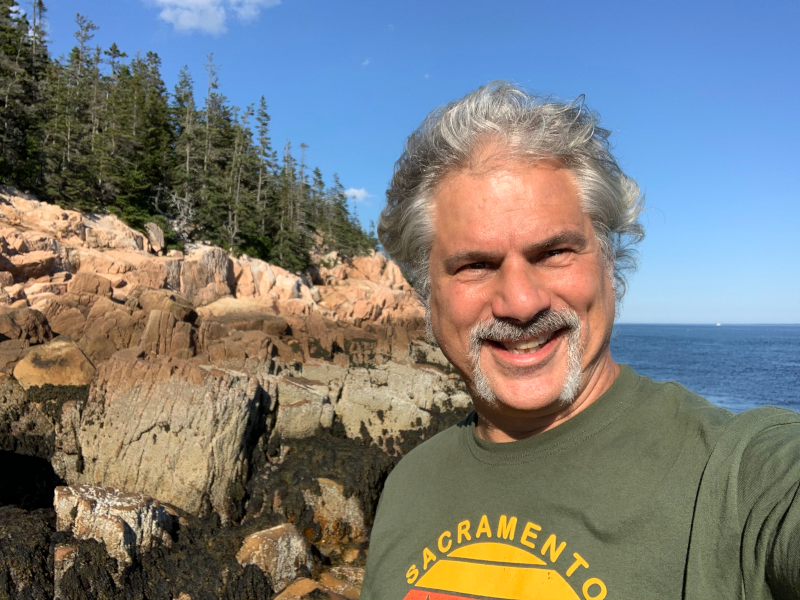

# Knowledge Systems Readme
**Synopsis:** This is a collection of Markdown Files that are designed to be used as an [Obsidan](https://obsidian.md/)  Knowledge Vault.

# Introduction
This archive is intended to be an introduction to and example of a "Personal Knowledge Management System" or "Second Brain" system.  The purpose of these systems is to allow you to be able to keep track of large amount of notes that you have made, draw connections between ideas, and generate new original ideas using your existing notes.  These notes can be used to generate new original content, such as essays, books, web articles, You Tube videos - whatever you like! 

## Opinionated
This is also an opinionated  guide, because I have made some assumptions as to what software to use, and how to set it up.   These are things that you may not end up agreeing with, but we are assuming these as true in this knowledge vault in order to make things easier for new users. 

There are other pieces of software out there, and other organizing methods and templates. [GIYF](https://letmegooglethat.com/?q=Personal+Knowledge+Management+Systems+)!

The main Opinions We are holding here are:

* **Your data should be stored as plain text.**  This allows it to not be dependent upon any particular software, makes it easy to search and back up, and easy to feed into AI systems.  I got on this kick from [Youtube-NoBoilerplate-The Unreasonable Effectiveness of Plain Text](https://www.youtube.com/watch?v=WgV6M1LyfNY&t=26s)
  
* [Obsidian](https://obsidian.md) is the note taking tool to use.
  
* **Your notes should be backed up**.  Normally this means to an online repository.  There are several options for doing this in Obsidian:   See [[Readme-Obsidian Sync Methods]]

# Where to Go Next

The "Home Page" for this knowledge vault is [HOME-Personal Knowledge Management Systems](./HOME-Personal%20Knowledge%20Management%20Systems.md)
If you are unfamiliar with Obsidian, Visit [Readme-Installation](./Readmes/Readme-Installation.md)

Feel Free to Clone this repository as a starting point for your own PKM System! 

# About Me
My name is Steve Schilz, and I have been a Software Engineer since 1990, and also a compulsive note-taker.  I hope that this vault helps me to make more sense out of my notes, and will allow me to write articles and other things more effectively.  I live in Sacramento, California.   Picture below is of a trip I made to Maine during the Covid times.   Hence the crazy hair and mustache ! ;) 

