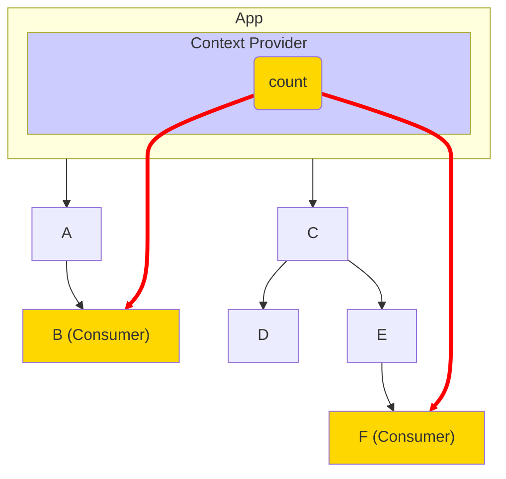
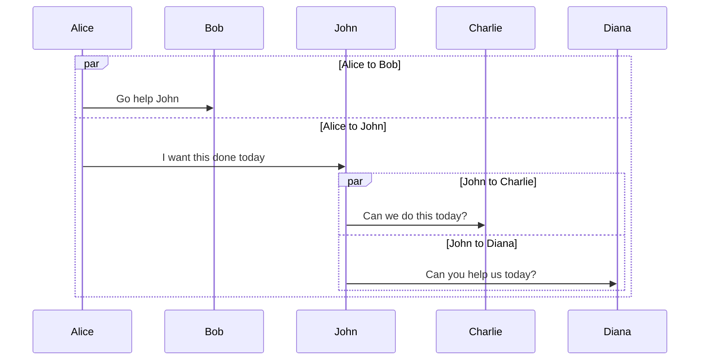

**Parent:** [Readme-Using Obsidian](./Readme-Using%20Obsidian.md)
**Related To:** #obsidian
**Date:** :2024/01/02 :16:00
**Category:** #readme
**Synopsis:** Information about Diagrams using Mermaid.js in Notion
**Tags:** #

# Basics
Mermaid Diagrams fit into the Obsidian/Text/Markdown philosophy, but they are somewhat cumbersome.  They are quite powerful, but take some learning. 

* use a code block with 'mermaid' as the language (three backticks followed by the word mermaid)
* To edit and preview at the same time, right click on the document title in the tab bar and split right. 

There are some online WYSIWIG Editors available. 

# Sample FlowChart with styling
	12
Refer to [Mermaid.js.org-Syntax-Reference](https://mermaid.js.org/intro/syntax-reference.html) for mor details.

## Sequence diagram

See [Mermaid.js.org-SequenceDiagram.html](https://mermaid.js.org/syntax/sequenceDiagram.html) for details

**Sequence Diagram with Parallelism**

## References
* Refer to [Mermaid.js](https://mermaid.js.org/intro/) or maybe this [Mermaid Cheat Sheet](https://jojozhuang.github.io/tutorial/mermaid-cheat-sheet/) for syntax info
