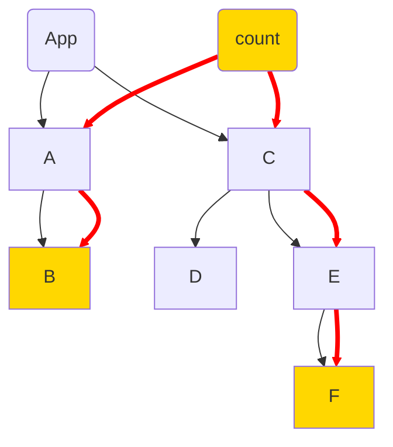

Parent:      [[HOME-Personal Knowledge Management Systems]]
Category: #readme
Tags:        #obsidian 
Synopsis:  **Using the Obsidian tool**, including notes on Obsidian Markdown

**Table of Contents**

```table-of-contents
```
# Introduction
Obsidian is a powerful software tool designed to turn simple text files into a powerful knowledge cross referencing system.   This guide attempts to get you started using Obsidian, and demonstrate some of the power.  It also serves as a reference for some things I had to look up when I was getting started

# OBSIDIAN UI - Icons and Sidebars
## TODO-ObsidianScreenshot
Take a screenshot of Obsidian title bar update readme
	* Explain opening closing the bars
	* Expain how to get back to the folder view
	* Explain Backlinks 

**Title Bar** Contains the Most  important Icons: 
*  📂 **Folder Icon** shows the file structure
*  🔎 **Search Icon**  to search for tags, files, or text
* 🔖 **Bookmark icon** shows your bookmarks
* **Side Pane Icons** open and close the panes on the left and right 
	* \[\[\ ] - Open left side pane 
	* \[ \]\] - Open Right Side Pane
* **Open Tabs** - Tabs representing open files occupy the central area of theTitle Bar

**Left Sidebar** 
* **Tag Cloud** - Show the Global Tag Cloud
* **Canvas** - Opens a workspace where you can draw diagrams, put pictures, include PDF...
* **Today's Daily Note** - Creates or opens a new note with the current date
* **Insert Template** - Insert a new note based on a template (⌘-T or Cttl-t)
* **Command Palette** - Opens a window that lets you search for commands, (Try toggle!)


## Using Obsidian (General)

1. First you have to **understand Markdown**, start with he official [Obsidian Markdown Reference](https://help.obsidian.md/Editing+and+formatting/Basic+formatting+syntax)
2. Learn how to use [Tabs in Obsidian](https://help.obsidian.md/User+interface/Use+tabs+in+Obsidian)
   
3. **Creating Notes/Applying Template:** 
	1. ctrl-n = create new note, or maybe
	2. ctrl+o = open -> Helps to find related notes
	3. After creating Note press   **"Ctrl-T"** to apply a template (See [[ZettelKastenSystem#Types of Notes]])
	
4. **Using Tags**
	1. **Taxonomy:** Visit the [[Readme-Tag Taxonomy]] to learn the tag names
	2. **Tag References:** Tap on a tag anywhere to show all references to a tag in the left pane
	    (click file folder icon in the top left of titl bard to get back to folder view)
	3. **Renaming Tags:** If the TagWrangler plugin is installed an enabled, right click on any tag to rename. 
	4. **Global Tag Map**: Clickthe Tag Map Icon (Below Search) in left sidebar to view the Tag Cloud
	5. **Local Tag Map:** use ellipsis at upper map of page -> Open Linked View -> Local Tag Map
		1. Use "Filters" to adjust depth of local tag map
	6. 
 ---
# Plugin Use
## Automatic table of contents
* use 'table-of-contents' in a code block (three backticks)
* Requires first heading to be level one (single poundsign)
## Kanban
*  See the [Kanban Plugin Docs](https://publish.obsidian.md/kanban/Obsidian+Kanban+Plugin)
	
## Extract Url
**ExtractUrl** - See the [Readme in Github](https://github.com/trashhalo/obsidian-extract-url#readme)
* **Initial Setup**
		1.  Settings-> Community Plugins -> Extract Url (Stephen Solka) (trashalo on GitHub)
		2. Enable the plugin
		3. In Obsidian Settings Define A Hotkey (e.g. Cmd-Shift-E => Extract Document)
		4. I defined an "extract Url " template for use with docment mode
* **Basic Use***
		1. Create a new Note, ⌘-T to apply the "ExtracUrl" template
		2. Paste the link as noted
		3. Press. ⌘-Shift-E to get the doc text

## Mermaid Tools
* create a code block with the language set to mermaid (three backticks+mermaid)
* See Separate [Readme-Mermaid Diagrams](Readme-Mermaid%20Diagrams.md) for more info




# Obsidian Markdown Notes

* **Separating Tags from Headers** : Headers have a space after the hashtag, Tags do not.
* **Relative Paths:** Always starting paths with a ./ or ../ helps with seeing them in other Markdown readers
   
* **Link to internal anchor** (heading in note):   See [Obsidian: internal Links](https://help.obsidian.md/Linking+notes+and+files/Internal+links) .  
	*  Syntax:  [ [ Note Heading # internal anchor name] ]
	*  Example [[Readme-Using Obsidian#Things to learn about Obsidian]] 
	  
* **Images**.  To display an image use one of 
	* Obsidian Style    ! [ [ image-file-name ] |100x150]  (Works only in obsidian)
	* Relative file path:  :\[Title\]\\(../../image-file-name.png). (Works on GitHub!)
	* See [Stack Overflow: Changing Image Size in Markdown](https://stackoverflow.com/questions/14675913/changing-image-size-in-markdown)
	* Centering Images:  See [reddit-ObsidianMD-does_anyone_know_how_to_place_images_in_the_center](https://www.reddit.com/r/ObsidianMD/comments/10uu09c/does_anyone_one_how_to_place_images_in_the_center/) and the "centerImage" snippet in the Obsidian snippets folder


----
# Troubleshooting 
## Obsidian Generates Temp files called "Icon?""
See note at  [[Readme-Obsidian Sync Methods#Problems with Icon?]]

## Things that confused me about Markdown In General:

I often expect Markdown Viewers to work like Word or Google Docs.  Markdown is not quite that capable.   These are things where I commonly am not able to accomplish exactly what I am setting out to do. 

* **Multi-Level Lists** In general, [Multi-level Lists](https://www.makeuseof.com/how-to-create-lists-obsidian/) in markdown are pretty easy, however in Obsidian, it is not easy to create second-level lists with a., b., c. .. Instead, use bullet points for second level lists as recommended in this [Obsidian feature request](https://forum.obsidian.md/t/multi-level-lists-and-alphabetic-lists/3889)
  
* **Indenting Text:**  Creating things like a list with titles and a paragraph indent is not easy in Markdown.  Major flaw, IMO.   However, the web shares this characteristic. 

# Other Readmes
* [Readme-Tag Taxonomy](Readme-Tag%20Taxonomy.md) - List of Tags
* [Readme-Installation](Readme-Installation.md) - Installing Obsidian, creating new vaults, settings